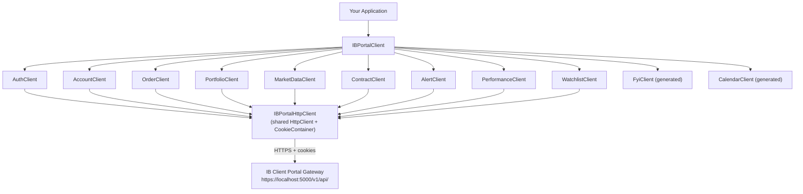
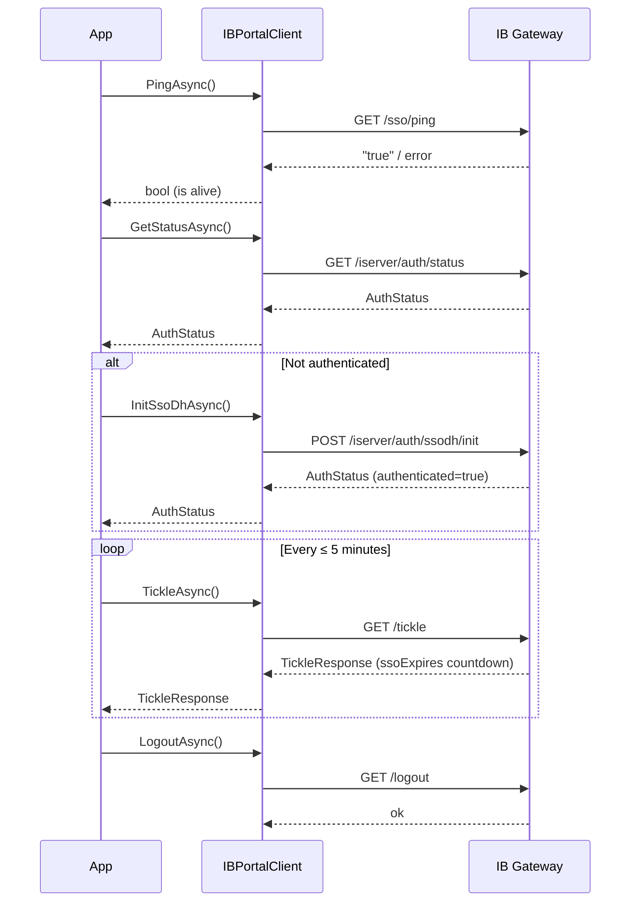
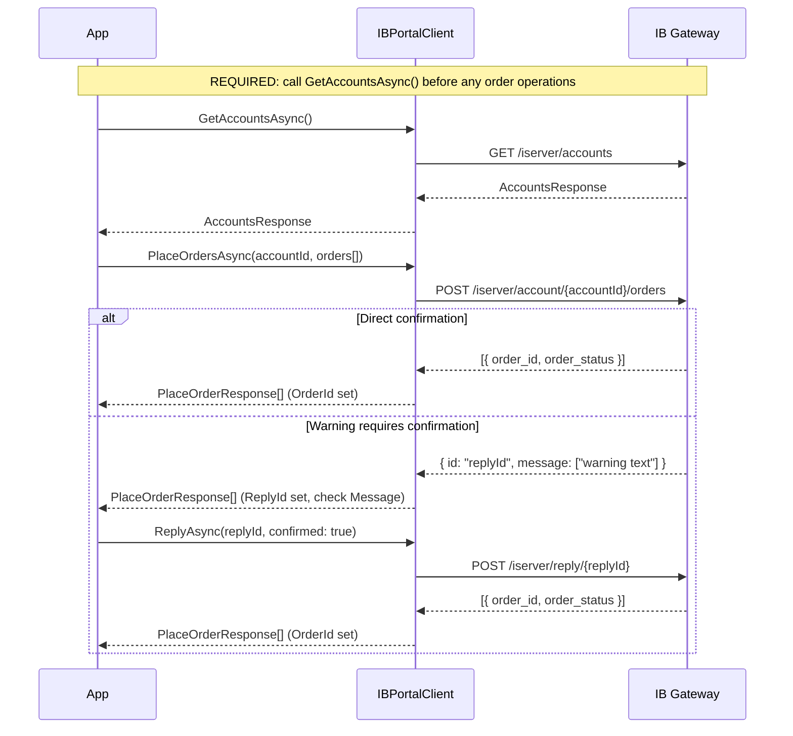
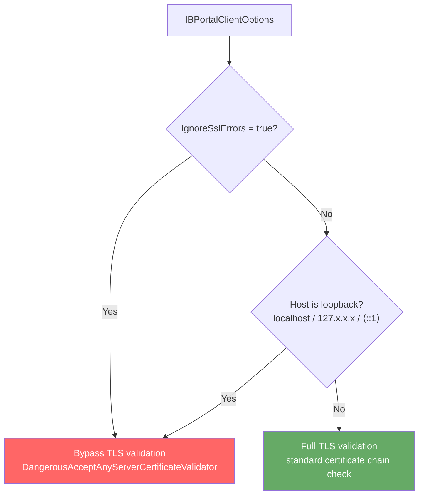

# IB ClientPortal WebAPI Client

[](https://www.nuget.org/packages/IB.ClientPortal.Client)
[](https://www.nuget.org/packages/IB.ClientPortal.Client)
[](https://github.com/alexgcherk/InteractiveBrokers_ClientPortal_WebAPI/actions/workflows/ci.yml)
[](LICENSE)

A typed .NET 8 client library for the [Interactive Brokers Client Portal Web API](https://www.interactivebrokers.com/en/trading/ib-api.php) (also known as the **IB Gateway**). Wraps every endpoint in a strongly-typed, async-first interface so you can trade, query positions, stream market data and manage alerts without hand-rolling HTTP calls.

```bash
dotnet add package IB.ClientPortal.Client
```

---

## Table of Contents

- [Architecture](#architecture)
- [Prerequisites](#prerequisites)
- [Project Structure](#project-structure)
- [Configuration](#configuration)
- [Quick Start](#quick-start)
- [Authentication Flow](#authentication-flow)
- [Client Reference](#client-reference)
  - [Auth](#auth)
  - [Account](#account)
  - [Orders](#orders)
  - [Portfolio](#portfolio)
  - [Market Data](#market-data)
  - [Contracts](#contracts)
  - [Alerts](#alerts)
  - [Performance Analytics](#performance-analytics)
  - [Watchlists](#watchlists)
- [Order Placement Flow](#order-placement-flow)
- [Examples](#examples)
- [Security](#security)
- [Testing](#testing)

---

## Architecture

The solution is built around a single `IBPortalClient` that exposes one typed client per domain. All clients share a single `HttpClient` instance with a persistent `CookieContainer` so session cookies (the rolling `x-sess-uuid`) are handled automatically.



---

## Prerequisites

| Requirement | Version |
|---|---|
| [.NET SDK](https://dotnet.microsoft.com/download) | 8.0+ |
| [IB Client Portal Gateway](https://www.interactivebrokers.com/en/trading/ib-api.php) | latest |
| Interactive Brokers account | Paper or live |
| [Newtonsoft.Json](https://www.nuget.org/packages/Newtonsoft.Json) | 13.0.3 *(only runtime dependency)* |

The gateway must be running locally before any calls are made. It uses a self-signed TLS certificate — the library handles this automatically for `localhost` (see [Security](#security)).

---

## Project Structure

```
InteractiveBrokers_ClientPortal_WebAPI/
├── IB.ClientPortal.Client/               # Library — the client you reference
│   ├── IBPortalClient.cs                 # Main entry point
│   ├── IBPortalClientOptions.cs          # Configuration
│   ├── IBPortalHttpClient.cs             # Low-level HTTP wrapper
│   ├── Clients/                          # One file per domain
│   │   ├── AuthClient.cs
│   │   ├── AccountClient.cs
│   │   ├── OrderClient.cs
│   │   ├── PortfolioClient.cs
│   │   ├── MarketDataClient.cs
│   │   ├── ContractClient.cs
│   │   ├── AlertClient.cs
│   │   ├── PerformanceClient.cs
│   │   └── WatchlistClient.cs
│   ├── Models/                           # Strongly-typed request/response models
│   └── Generated/                        # NSwag-generated FYI and Calendar clients
│
├── IB.ClientPortal.Client.UnitTests/     # Fast, offline unit tests (Moq + NUnit)
│   ├── Clients/                          # Per-domain test files
│   │   └── SecurityTests.cs              # SSL bypass, URL encoding, exception handling
│   └── MockHttpHandler.cs                # Shared mock infrastructure
│
└── IB.ClientPortal.IntegrationTests/     # Live integration tests (require running gateway)
    ├── GlobalSetup.cs                    # Assembly-level setup; creates shared client
    ├── GatewaySettings.cs                # Config model
    ├── appsettings.integration.json      # Non-secret defaults (committed)
    └── appsettings.integration.local.json  # ⚠ Private values (gitignored)
```

---

## Configuration

### `IBPortalClientOptions`

| Property | Type | Default | Description |
|---|---|---|---|
| `BaseUrl` | `string` | `"https://localhost:5000"` | Gateway base URL |
| `AccountId` | `string?` | `null` | Default account ID for account-scoped calls |
| `IgnoreSslErrors` | `bool` | `false` | Bypass TLS validation. **Not needed for localhost** — the library auto-bypasses for loopback addresses |
| `RequestTimeout` | `TimeSpan` | 15 seconds | Per-request HTTP timeout |
| `SessionCookie` | `string?` | `null` | Pre-seed the `x-sess-uuid` cookie (advanced — see [Authentication Flow](#authentication-flow)) |

### Integration Test Secrets

Copy your real credentials into the gitignored local override file:

```jsonc
// IB.ClientPortal.IntegrationTests/appsettings.integration.local.json  (gitignored)
{
  "Gateway": {
    "BaseUrl": "https://localhost:5000",
    "AccountId": "DU1234567",
    "IgnoreSslErrors": false,
    "RequestTimeoutSeconds": 30,
    "SessionCookie": ""        // optional — leave empty for automatic acquisition
  }
}
```

---

## Quick Start

```csharp
using IB.ClientPortal.Client;

// 1. Create the client
var options = new IBPortalClientOptions
{
    BaseUrl   = "https://localhost:5000",
    AccountId = "DU1234567"
    // IgnoreSslErrors is false by default; localhost is bypassed automatically
};
using var client = new IBPortalClient(options);

// 2. Verify gateway is alive
var alive = await client.Auth.PingAsync();
Console.WriteLine($"Gateway alive: {alive}");

// 3. Authenticate
var status = await client.Auth.GetStatusAsync();
if (status?.Authenticated != true)
{
    await client.Auth.InitSsoDhAsync();
    await Task.Delay(2000);
}

// 4. REQUIRED before any order operations
var accounts = await client.Account.GetAccountsAsync();
Console.WriteLine($"Accounts: {string.Join(", ", accounts!.Accounts!)}");

// 5. Keep the session alive every ~5 minutes
await client.Auth.TickleAsync();
```

---

## Authentication Flow

The IB gateway uses a web-based SSO session. The client must authenticate before any trading or market data calls, and must send a keepalive (`/tickle`) at least every 5 minutes or the session expires.



---

## Client Reference

### Auth

| Method | Description |
|---|---|
| `PingAsync()` | Checks whether the gateway process is reachable |
| `GetStatusAsync()` | Returns current brokerage session state (`Authenticated`, `Established`) |
| `InitSsoDhAsync()` | Opens (or re-opens) a brokerage session |
| `ReauthenticateAsync()` | Forces re-authentication |
| `TickleAsync()` | Keepalive — call at least every 5 minutes |
| `LogoutAsync()` | Ends the current session |

### Account

| Method | Description |
|---|---|
| `GetAccountsAsync()` | Retrieves account list and sets trading context. **Must be called before order operations.** |
| `GetSummaryAsync(accountId)` | Full account summary: buying power, margins, balances |
| `GetPnlAsync()` | Daily PnL broken out per account/segment |
| `GetUserAsync()` | Current user info and feature flags |
| `GetMtaAsync()` | Mobile Trading Assistant alert data |
| `SwitchAccountAsync(accountId)` | Switches the active account |
| `GetCurrencyPairsAsync(currency)` | All currency pairs for a base currency (default `"USD"`) |
| `GetExchangeRateAsync(source, target)` | Spot exchange rate between two currencies |
| `GetSignaturesAndOwnersAsync(accountId)` | Applicant names on the account |

### Orders

| Method | Description |
|---|---|
| `GetOrdersAsync(filters?)` | Live orders; optionally filter by status (`"filled,cancelled"`) |
| `GetTradesAsync(days?)` | Today's filled trades; optionally look back N days |
| `PlaceOrdersAsync(accountId, orders[])` | Place one or more orders |
| `WhatIfAsync(accountId, orders[])` | Simulate order impact (margin/commission) without placing |
| `ModifyOrderAsync(accountId, orderId, order)` | Modify an existing order |
| `CancelOrderAsync(accountId, orderId)` | Cancel an order; `orderId = -1` cancels all |
| `GetOrderStatusAsync(orderId)` | Detailed status of a single order |
| `ReplyAsync(replyId, confirmed)` | Confirm a pending order warning (must call immediately after warning) |
| `SuppressMessagesAsync(messageIds[])` | Pre-suppress known warning codes (e.g. `"o163"`) |
| `ResetSuppressedMessagesAsync()` | Clears all suppressed messages |

### Portfolio

| Method | Description |
|---|---|
| `GetAccountsAsync()` | All accounts with full metadata |
| `GetSubAccountsAsync()` | Sub-account list |
| `GetSubAccountsPagedAsync(page)` | Paginated sub-accounts (advisors with >100 accounts) |
| `GetPositionsAsync(accountId, page)` | Positions page (0-based) |
| `GetFirstPositionsAsync(accountId)` | Shortcut for first positions page |
| `GetPositionByConidAsync(accountId, conid)` | Position for a specific contract |
| `InvalidatePositionCacheAsync(accountId)` | Invalidates the server-side position cache |
| `GetAllocationAsync(accountId)` | Asset class, sector and group allocation breakdown |
| `GetLedgerAsync(accountId)` | Cash balances per currency |
| `GetMetaAsync(accountId)` | Full account metadata |

### Market Data

| Method | Description |
|---|---|
| `GetSnapshotAsync(conids, fields)` | Real-time snapshot (first call subscribes; second returns data) |
| `GetAltSnapshotAsync(conids, fields)` | Alternative snapshot endpoint via `/md/snapshot` |
| `GetRegSnapshotAsync(conid)` | Regulatory snapshot — ⚠ costs $0.01 per call |
| `GetHistoryAsync(conid, period, bar, exchange?, outsideRth)` | Historical OHLCV bars |
| `UnsubscribeAllAsync()` | Cancel all active market data subscriptions |
| `UnsubscribeAsync(conid)` | Cancel subscription for a single contract |
| `GetScannerParamsAsync()` | Full scanner configuration (cached 15 min) |
| `RunScannerAsync(request)` | Execute a market scanner |

**Commonly used field codes** (via `MarketDataFields`):

```csharp
MarketDataFields.Last      // "31" — last traded price
MarketDataFields.Bid       // "84"
MarketDataFields.Ask       // "86"
MarketDataFields.Volume    // "87"
MarketDataFields.EquityDefault  // pre-built set: Last, Bid, Ask, Size, Volume, OHLC, Change
```

### Contracts

| Method | Description |
|---|---|
| `SearchAsync(symbol, secType?, nameSearch)` | Search contracts by symbol |
| `GetInfoAsync(conid)` | Contract details |
| `GetInfoAndRulesAsync(conid)` | Contract info plus order rules |
| `GetRulesAsync(request)` | Order rules for a given contract and side |
| `GetStrikesAsync(conid, month, secType, exchange?)` | Option strike list |
| `GetSecDefInfoAsync(conid, secType, month?, strike?, right?)` | Derivative secdef |
| `GetSecDefAsync(conids)` | Full secdef with trading rules |
| `GetStocksAsync(symbols)` | Stock contracts by symbol |
| `GetFuturesAsync(symbols)` | Non-expired futures contracts |
| `GetAllConidsAsync(exchange, assetClass)` | All contract IDs on an exchange |
| `GetTradingScheduleAsync(assetClass, symbol, exchange?)` | Trading schedule per venue |
| `GetContractTradingScheduleAsync(conid, exchange?)` | 6-day schedule with epoch times |
| `GetAlgosAsync(conid, algos?, addDescription, addParams)` | IB Algo strategies |
| `GetBondFiltersAsync(symbol, issuerId)` | Bond search filter options |

### Alerts

| Method | Description |
|---|---|
| `GetAlertsAsync(accountId)` | List all alerts for an account |
| `GetAlertAsync(orderId)` | Full details of a specific alert |
| `CreateAlertAsync(accountId, request)` | Create or update an alert |
| `SetAlertActiveAsync(accountId, alertId, active)` | Activate or deactivate an alert |
| `DeleteAlertAsync(accountId, alertId)` | Delete an alert; `alertId = 0` deletes all |
| `GetMtaAlertAsync()` | Mobile Trading Assistant alert |

### Performance Analytics

> ⚠ All PA endpoints are rate-limited to **1 request per 15 minutes**.

| Method | Description |
|---|---|
| `GetPerformanceAsync(accountIds[], period)` | Portfolio performance time series. Periods: `"1M"`, `"3M"`, `"6M"`, `"1Y"`, `"2Y"`, `"3Y"`, `"5Y"`, `"MTD"`, `"YTD"` |
| `GetSummaryAsync(accountIds[])` | Portfolio summary by asset class |
| `GetTransactionsAsync(accountIds[], conids[], currency)` | Transaction history for specific contracts |

### Watchlists

| Method | Description |
|---|---|
| `GetWatchlistsAsync()` | All watchlists (system and user-defined) |
| `CreateWatchlistAsync(id, name, conids[])` | Create a watchlist |
| `GetWatchlistAsync(id)` | Get a specific watchlist |
| `DeleteWatchlistAsync(id)` | Delete a watchlist |

---

## Order Placement Flow

Placing an order can return either a **direct confirmation** or a **warning** that requires an immediate reply. The client handles both response shapes.



---

## Examples

### Place a Limit Order

```csharp
// Pre-flight
await client.Account.GetAccountsAsync();

// Suppress common warnings so PlaceOrdersAsync confirms directly
await client.Orders.SuppressMessagesAsync(["o163", "o354"]);

var order = new PlaceOrderBody
{
    AccountId = "DU1234567",
    Conid     = 265598,          // AAPL contract ID
    SecType   = "265598:STK",
    Side      = "BUY",
    OrderType = "LMT",
    Price     = 195.00,
    Quantity  = 10,
    Tif       = "DAY"
};

var responses = await client.Orders.PlaceOrdersAsync("DU1234567", [order]);

foreach (var r in responses!)
{
    if (r.ReplyId is not null)
    {
        Console.WriteLine($"Warning: {string.Join("; ", r.Message!)}");
        // Confirm the warning immediately — before any other request
        await client.Orders.ReplyAsync(r.ReplyId, confirmed: true);
    }
    else
    {
        Console.WriteLine($"Order placed: {r.OrderId} — {r.OrderStatus}");
    }
}
```

### Simulate an Order (What-If)

```csharp
var whatIf = await client.Orders.WhatIfAsync("DU1234567", [order]);
Console.WriteLine($"Estimated commission: {whatIf!.Amount?.Change}");
Console.WriteLine($"Initial margin impact: {whatIf.Initial?.Change}");
```

### Real-Time Market Data Snapshot

```csharp
// First call subscribes; poll until data is returned
string conids = "265598,8314";   // AAPL, IBM
string fields = MarketDataFields.EquityDefault;

MarketDataSnapshot[]? snapshot = null;
for (int i = 0; i < 5 && snapshot is null or { Length: 0 }; i++)
{
    snapshot = await client.MarketData.GetSnapshotAsync(conids, fields);
    if (snapshot?.Length == 0) await Task.Delay(500);
}

foreach (var s in snapshot!)
    Console.WriteLine($"Conid {s.Conid}: last={s[MarketDataFields.Last]}");

// Clean up
await client.MarketData.UnsubscribeAllAsync();
```

### Historical Bars

```csharp
var history = await client.MarketData.GetHistoryAsync(
    conid:      265598,
    period:     "5d",
    bar:        "1h",
    outsideRth: false);

foreach (var bar in history!.Data!)
    Console.WriteLine($"{bar.TimeMs}: O={bar.Open} H={bar.High} L={bar.Low} C={bar.Close} V={bar.Volume}");
```

### Search for a Contract and Get Strikes

```csharp
// 1. Find AAPL
var results = await client.Contracts.SearchAsync("AAPL", secType: "STK");
long conid = results![0].Conid;

// 2. Get option strikes for a specific expiry month
var strikes = await client.Contracts.GetStrikesAsync(conid, month: "SEP25", secType: "OPT");
Console.WriteLine($"Call strikes: {string.Join(", ", strikes!.Call!)}");
```

### Portfolio Snapshot

```csharp
string accountId = "DU1234567";

var positions   = await client.Portfolio.GetFirstPositionsAsync(accountId);
var allocation  = await client.Portfolio.GetAllocationAsync(accountId);
var ledger      = await client.Portfolio.GetLedgerAsync(accountId);
var pnl         = await client.Account.GetPnlAsync();

Console.WriteLine($"Positions: {positions?.Length}");
Console.WriteLine($"USD cash:  {ledger!["USD"].CashBalance}");
Console.WriteLine($"Day PnL:   {pnl?.Upnl?.Values.Sum(x => x.Dpl):F2}");
```

### Create a Price Alert

```csharp
var alert = new CreateAlertRequest
{
    OrderType  = "P",
    AlertName  = "AAPL above 200",
    AlertRepeatable = 1,
    Conditions = [
        new AlertCondition
        {
            Type              = 1,
            Conid             = 265598,
            Operator          = ">=",
            TriggerValue      = "200.00",
            TimeZone          = "America/New_York"
        }
    ]
};

await client.Alerts.CreateAlertAsync("DU1234567", alert);
```

### Keepalive Loop

```csharp
using var cts = new CancellationTokenSource();

_ = Task.Run(async () =>
{
    while (!cts.Token.IsCancellationRequested)
    {
        await Task.Delay(TimeSpan.FromMinutes(4), cts.Token);
        await client.Auth.TickleAsync(cts.Token);
    }
}, cts.Token);
```

---

## Security



Key security properties of the library:

- **`IgnoreSslErrors` defaults to `false`** — must be explicitly enabled for non-local hosts
- **Localhost auto-bypass** — `localhost`, `127.x.x.x` and `::1` always bypass TLS (the IB gateway ships with a self-signed cert; this is expected)
- **`IgnoreSslErrors = true` on a remote host** is a MITM risk — only use in controlled, internal networks
- **All string parameters are URL-encoded** (`Uri.EscapeDataString`) before interpolation into query strings
- **`PingAsync` only catches `HttpRequestException` / `TaskCanceledException`** — unexpected exceptions (including security errors) propagate
- **Secrets are kept out of source control** — `appsettings.integration.local.json` is gitignored; only placeholder values are committed

---

## Testing

### Unit Tests

Fully offline — no gateway required. Uses `Moq` to intercept HTTP at the handler level.

```bash
dotnet test IB.ClientPortal.Client.UnitTests
```

71 tests covering:
- Response deserialization for every domain client
- Security scenarios (`SecurityTests.cs`): SSL bypass logic, URL encoding of special characters, `PingAsync` exception handling

### Integration Tests

Require a running IB gateway with a valid session. Populate `appsettings.integration.local.json` first (see [Configuration](#configuration)).

```bash
dotnet test IB.ClientPortal.IntegrationTests
```

The assembly-level `GlobalSetup` creates a single shared `IBPortalClient`, verifies authentication, and pre-warms `/iserver/accounts` before any test runs.
